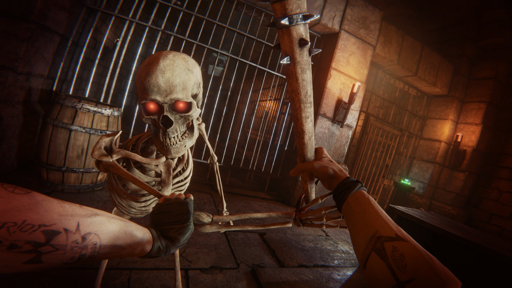
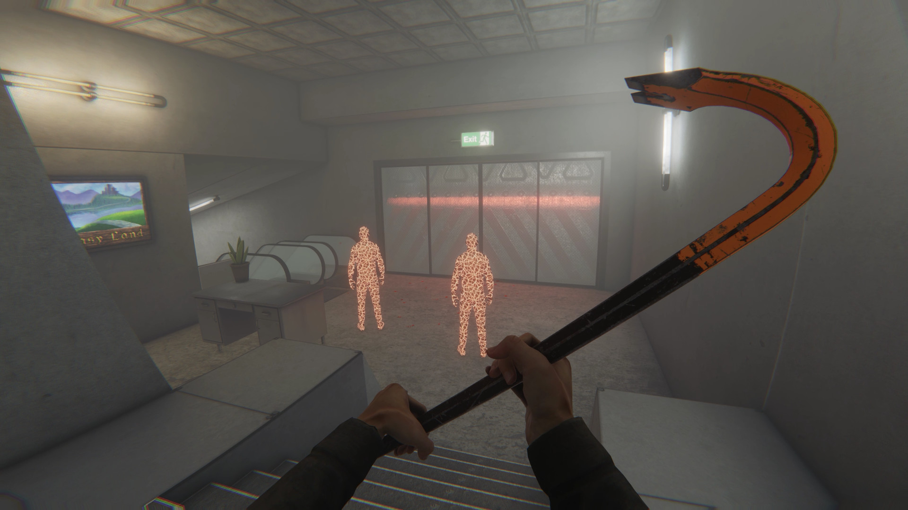
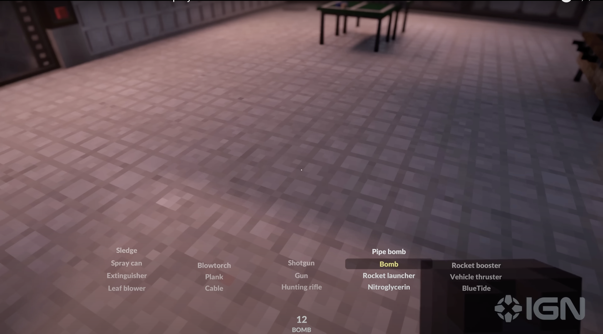

# Shakespeare Game

As the character, the player will get put into the world of a Shakespeare play. The game will take place following the lore of a play. The game will consist of plays, chapters, and missions.

The loading screen will allow the player to select which play to enter. Then when selecting a play, it will allow the player to select which chapter to play. Chapters will unlock sequentially after completing each one.

The game will take place in a Bonelab (game) vibe, 3D environment, but in a medival, more peaceful setting. Each chapter will consist of doing a few quests/missions to complete the chapter. Sometimes these missions will align with the original text, like spreading lies about Antonio or disguising yourself to get an audience with a noble. But as the play goes on, the missions will become more entertaining, as in, "acquire the boom-stick" and "send forth thy fire". It will culminate in either ending the story in the way it was intended, or going crazy with the "acquired arms" and destroying everything.

For each mission, there will be a puzzle that the player must solve in order to progress the story. However, hidden throughout the level, there will be certain items that will allow the player to mess up the story. The interaction with the game will consist of traveling throughout the level, looking for items, solving puzzles, and talking to characters.

## Core Features
### Walking
The character can move around using the WASD keys and mouse, like in similar RPGS.
### Shakespearing
Clicking the Q key emits a singlular random Shakespear quote
### Interacting (Speech)
Clicking the interact key (e) allows the character to engage in interactions with the NPCs powered by ChatGPT. The NPCs have information in their context for the user to discover to progress the game.
### Interacting (Carry)
Interacting with objects using (e) makes the character collect the given object, or interact with it if it is a puzzle.
### Interacting (Use)
Pressing the left or right mouse buttons will use the equipped item. For example, right click to aim the boom stick and left click to fire.
### Interacting (Switch Item)
Using the scroll wheel will switch between items in the inventory. Pressing a number key will also switch to an item. Using a Teardown (game) style inventory selector.
### Inventory
The character can hold items in a Teardown (game) style inventory. Items are arranged together by category

## User Flow
### Loading Screen
The loading screen allows the user to select which "play"/quest to enter. Chapters will unlock sequentially after completing each one. 
### Game Environment
The game environment is where all the core features are implemented, and each quest consists of NPCs and puzzles that the user can interact with 